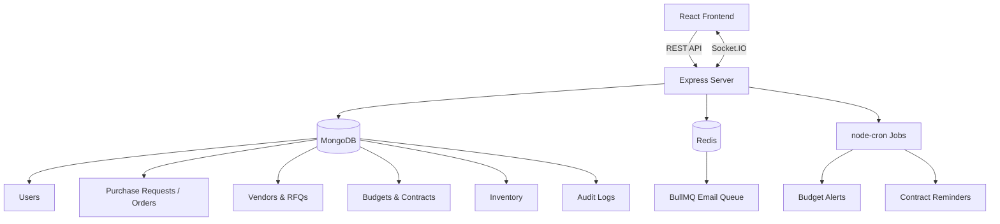

---
# 🧾 Enterprise Procurement Platform

<p align="center">
  
  
  
  
  
  
  
  
</p>

A full-stack procurement and vendor management platform built on the **MERN stack**, with **Redis-backed job queues**, **Socket.IO** real-time notifications, and **role-based multi-step approvals**. It digitizes the entire purchasing lifecycle — requests, RFQs, vendor quotes, purchase orders, budgets, contracts, and inventory — with analytics dashboards and a full audit trail baked in.

---

## 📚 Table of Contents

- [Overview](#-overview)
- [Features](#-features)
- [Tech Stack](#-tech-stack)
- [System Architecture](#-system-architecture)
- [Approval Workflow](#-approval-workflow)
- [Project Structure](#-project-structure)
- [Installation](#-installation)
- [Environment Variables](#-environment-variables)
- [Running the Application](#-running-the-application)
- [Real-Time Features](#-real-time-features)
- [API Overview](#-api-overview)
- [Performance Highlights](#-performance-highlights)
- [Security](#-security)
- [Roadmap](#-roadmap)
- [Built With](#-built-with)
- [Author](#-author)
- [Show Your Support](#-show-your-support)
- [License](#-license)

---

## 📖 Overview

The Enterprise Procurement Platform replaces spreadsheet-and-email procurement with a single system of record. Department staff raise purchase requests, requests move through a configurable multi-role approval chain, procurement officers solicit and compare vendor quotes, approved requests become purchase orders, and finance/leadership get live visibility into budget utilization, vendor performance, and contract compliance — all backed by an immutable audit log.

This project was built to demonstrate production-grade full-stack architecture: layered backend design (routes → controllers → services → repositories), background job processing, real-time events, and a role-aware React frontend.

---

## ✨ Features

### 🔐 Authentication & Access Control
- JWT authentication (REST via Bearer token, sockets via handshake auth)
- Password hashing with bcrypt, self-service password reset via email
- Role-based access control (department, finance manager, procurement manager/officer, CEO, admin)
- Protected routes on both API and frontend

### 📝 Purchase Requests & Orders
- Raise, edit, and track purchase requests from submission to fulfillment
- Convert approved requests into purchase orders
- Full lifecycle status tracking

### ✅ Multi-Step Approval Workflow
- Configurable role-sequenced approval chain: **Department → Finance Manager → Procurement Manager → CEO**
- Each stage records its own approval status; rejects short-circuit the chain
- Approval history visible per request

### 🏢 Vendor Management
- Vendor profiles with multiple bank accounts (add, update, delete, set primary)
- Vendor status summaries and performance rankings

### 📨 RFQ / Quotations
- Request quotes from multiple vendors per purchase request
- Compare pricing side-by-side before awarding
- Status summary dashboard for open/closed RFQs

### 💰 Budget Management
- Department-level budget tracking and utilization reporting
- Automated **budget alert jobs** (cron) when spend approaches a threshold

### 📄 Contract Management
- Store and track vendor contracts
- Automated **contract reminder jobs** ahead of renewal/expiry
- Contract compliance rate reporting

### 📦 Inventory
- Track stock levels and pending deliveries
- Filterable delivery queue

### 📊 Analytics Dashboard
- Executive dashboard summary
- Vendor rankings & individual vendor performance
- Budget utilization and department spend breakdowns
- Procurement spend trend over time
- Contract compliance rate — all charted with Recharts

### 🔔 Real-Time Notifications
- Live in-app notifications over Socket.IO for approvals, deliveries, and alerts
- Notification bell with read/unread state

### 🧾 Audit Logging
- Admin-only, append-only log of key actions across the platform for compliance and traceability

---

## 🛠 Tech Stack

### Frontend
- React 18 + Vite
- Material UI (MUI) + Emotion
- Zustand (client state)
- TanStack Query (server state / data fetching)
- Recharts (analytics visualization)
- Axios, Socket.IO Client, React Router

### Backend
- Node.js + Express 5
- MongoDB + Mongoose
- Redis (`ioredis`) — caching and queue backend
- BullMQ — background job/email processing
- node-cron — scheduled budget alert & contract reminder jobs
- Socket.IO — real-time events
- JWT + bcrypt — authentication
- Joi — request validation
- Helmet, CORS, express-rate-limit, compression, Multer, Nodemailer, Morgan

---

## 🏗 System Architecture



**Flow summary:**
1. The React frontend talks to the Express server via REST endpoints for standard CRUD operations (auth, requests, vendors, budgets, contracts, inventory, analytics).
2. Socket.IO maintains persistent connections for real-time notifications (approvals, deliveries, budget alerts).
3. MongoDB persists all core application data via a repository layer.
4. Redis backs dashboard/vendor caching and the BullMQ email queue; node-cron drives scheduled budget alert and contract reminder jobs.

---

## ✅ Approval Workflow

Purchase requests move through a fixed, role-sequenced approval chain. Each stage must approve before the request advances; a rejection at any stage halts the workflow.

```
Department → Finance Manager → Procurement Manager → CEO
```

| Stage | Role | Result Status |
|---|---|---|
| 1 | `department` | Department Approved |
| 2 | `finance_manager` | Finance Approved |
| 3 | `procurement_manager` | Procurement Approved |
| 4 | `ceo` | CEO Approved |

Approval actions, timestamps, and approver identity are all recorded and surfaced through the audit log.

---

## 📂 Project Structure

```
Enterprise-Procurement-Platform/
├── backend
│   ├── src
│   │   ├── config           # db.js, redis.js
│   │   ├── controllers       # auth, user, budget, contract, RFQ, vendor, inventory,
│   │   │                      # purchase-request, purchase-order, approval, analytics, audit-log
│   │   ├── jobs               # budgetAlert.job.js, contractReminder.job.js (node-cron)
│   │   ├── middleware          # auth, restrictTo, socketAuth, upload
│   │   ├── models               # User, Vendor, Budget, Contract, RFQ, Inventory,
│   │   │                         # purchase-request, purchase-order, approval, audit-log, Notification
│   │   ├── queues                # email.queue.js (BullMQ)
│   │   ├── repositories            # data access layer, one per domain
│   │   ├── routes                   # REST endpoints, one per domain
│   │   ├── services                  # business logic layer
│   │   ├── utils                      # AppError, calculators, price comparison, socketManager
│   │   └── validations                # Joi schemas
│   ├── app.js                # Express app setup
│   └── start.js               # Server entry point
│
├── frontend
│   ├── src
│   │   ├── components         # charts, common, layout, notifications
│   │   ├── config               # constants
│   │   ├── hooks                 # useAuth, useBudget, useContract, useInventory, useRFQ,
│   │   │                          # useVendor, useSocket, routes/context helpers
│   │   ├── lib                     # api.js (Axios), socket.js
│   │   ├── pages                    # Dashboard, Purchase Requests/Orders, Approvals,
│   │   │                             # Vendors, Budget, Contracts, Inventory, Analytics,
│   │   │                             # Auth pages, Profile, Audit Logs
│   │   ├── routes                     # AppRoutes, ProtectedRoute, PublicRoute
│   │   ├── stores                      # authStore, notificationStore (Zustand)
│   │   └── theme                        # MUI theme
│   └── vite.config.js
│
└── package.json
```

---

## 🚀 Installation

### Clone Repository

```bash
git clone https://github.com/Omar-Hashmi/Enterprise-Procurement-Platform.git
cd Enterprise-Procurement-Platform
```

### Install Dependencies

**Backend**
```bash
cd backend
npm install
```

**Frontend**
```bash
cd ../frontend
npm install
```

### Infra (MongoDB + Redis)

Run local instances of MongoDB and Redis, or point `MONGO_URI` / `REDIS_HOST` at hosted services (e.g. MongoDB Atlas, Redis Cloud).

---

## ⚙ Environment Variables

**backend/.env**
```env
MONGO_URI=mongodb://localhost:27017/procurement-db
JWT_SECRET=your_jwt_secret

# Optional — Redis (caching, BullMQ email queue)
REDIS_HOST=127.0.0.1
REDIS_PORT=6379

# Optional — SMTP (email notifications)
SMTP_HOST=smtp.example.com
SMTP_PORT=587
SMTP_USER=username
SMTP_PASSWORD=password
SMTP_FROM=procurement@example.com
```

**frontend/.env**
```env
VITE_API_BASE_URL=http://localhost:5000/api
VITE_SOCKET_URL=http://localhost:5000
```

---

## ▶ Running the Application

**Backend**
```bash
cd backend
npm run dev
```

**Frontend**
```bash
cd frontend
npm run dev
```

Backend: `http://localhost:5000`
Frontend: `http://localhost:5173` *(Vite dev server, port may vary)*

### Production build

```bash
cd frontend && npm run build
cd ../backend && npm start
```

---

## 📡 Real-Time Features

Socket.IO powers live updates across the platform, including:

- Approval status changes pushed to relevant approvers
- Budget threshold alerts
- Contract renewal reminders
- Pending delivery / inventory notifications
- General in-app notification stream (read/unread state)

---

## 🔌 API Overview

All endpoints are prefixed with `/api`. Most routes require a valid JWT in the `Authorization` header; several are further restricted by role via `restrictTo`.

| Resource | Base Path | Description |
|---|---|---|
| Auth | `/api/auth` | Register, login, profile, password reset |
| Users | `/api/users` | User management |
| Purchase Requests | `/api/purchase-requests` | Create and track purchase requests |
| Vendors | `/api/vendors` | Vendor profiles & bank accounts |
| Quotations (RFQ) | `/api/quotations` | Request and manage vendor quotes |
| Purchase Orders | `/api/purchase-orders` | Create and track purchase orders |
| Approvals | `/api/approvals` | Multi-step approval workflow actions |
| Audit Logs | `/api/audit-logs` | Admin-only action history |
| Budgets | `/api/budgets` | Department budgets & utilization |
| Contracts | `/api/contracts` | Contract lifecycle & compliance |
| Inventory | `/api/inventory` | Stock levels & pending deliveries |
| Analytics | `/api/analytics` | Dashboards, vendor rankings, spend trends |

### Selected endpoints

| Method | Endpoint | Description |
|--------|----------|-------------|
| POST | `/api/auth/register` | Register a new user |
| POST | `/api/auth/login` | Log in and receive a JWT |
| GET | `/api/auth/profile` | Get current session user |
| POST | `/api/auth/request-password-reset` | Request a password reset email |
| GET | `/api/vendors/status-summary` | Vendor status breakdown |
| GET | `/api/quotations/status-summary` | RFQ status breakdown |
| GET | `/api/inventory/pending` | Pending deliveries |
| GET | `/api/analytics/dashboard` | Executive dashboard summary |
| GET | `/api/analytics/vendors/rankings` | Vendor performance rankings |
| GET | `/api/analytics/budgets/utilization` | Budget utilization report |
| GET | `/api/analytics/budgets/spend-trend` | Procurement spend trend |
| GET | `/api/analytics/contracts/compliance-rate` | Contract compliance rate |
| GET | `/api/audit-logs` | Admin-only audit log list |

---

## ⚡ Performance Highlights

- **BullMQ + Redis** offload email sending to a background queue instead of blocking request threads.
- **Redis caching layer** (`cache.service.js`) speeds up repeated dashboard and vendor lookups.
- **node-cron scheduled jobs** handle budget alerts and contract reminders without manual polling.
- **Layered architecture** (routes → controllers → services → repositories) keeps business logic decoupled from data access, making the codebase easier to test and scale.
- Production-only rate limiting and response compression keep local development friction-free while protecting the deployed API.

---

## 🔒 Security

- JWT authentication on both REST and socket layers
- Password hashing with bcrypt
- Role-based authorization (`authorize` / `restrictTo`) enforced at the route level
- Request validation with Joi on all mutating endpoints
- Helmet, CORS, and rate limiting on the Express app
- Immutable, admin-only audit log of sensitive actions
- Environment-based configuration (`.env`, never committed)

---

## 🚀 Roadmap

### 🧾 Procurement
- Multi-currency purchase orders
- Bulk purchase request import
- Vendor self-service portal

### 📊 Analytics
- Predictive budget forecasting
- Exportable PDF/Excel reports
- Custom dashboard widgets

### 🔐 Security
- Two-factor authentication (2FA)
- Single sign-on (SSO / SAML)
- Fine-grained, configurable permission sets

### ☁️ Infrastructure
- Cloud file storage integration (S3)
- Horizontal scaling via Redis-backed Socket.IO adapter
- Containerized deployment (Docker Compose / Kubernetes)

### 📱 Experience
- Mobile-responsive redesign
- Push notifications
- In-app approval reminders

---

## 🛠 Built With

**Frontend**
- ⚛️ React + Vite
- 🎨 Material UI (MUI) + Emotion
- 📦 Zustand
- 🔄 TanStack Query
- 📈 Recharts
- 🌐 Axios · 🔌 Socket.IO Client

**Backend**
- 🟢 Node.js · 🚂 Express 5
- 🍃 MongoDB · 📦 Mongoose
- 🚀 Redis · 🧵 BullMQ
- ⏰ node-cron
- 🔌 Socket.IO
- 🔑 JWT · 🔒 bcrypt
- ✅ Joi · 🛡️ Helmet

**Development Tools**
- Git & GitHub
- Visual Studio Code
- Postman
- npm

---

## 👨‍💻 Author

<p align="center">
  <b>Omar Hashmi</b><br/>
  Software Engineer building scalable full-stack platforms and workflow systems.
</p>

<p align="center">
  <a href="https://github.com/Omar-Hashmi">
    
  </a>
</p>

If you're interested in collaborating, discussing software development, or sharing ideas, feel free to connect!

---

## ⭐ Show Your Support

If you found this project useful or learned something from it:

- ⭐ Star this repository
- 🍴 Fork it and build your own version
- 🐞 Report bugs or suggest improvements
- 📢 Share it with others

---

## 📄 License

This project is licensed under the **MIT License**.
You are free to use, modify, and distribute this project in accordance with the license terms. See [LICENSE](./LICENSE) for details.

<p align="center">Made with ❤️ by Omar Hashmi</p>
